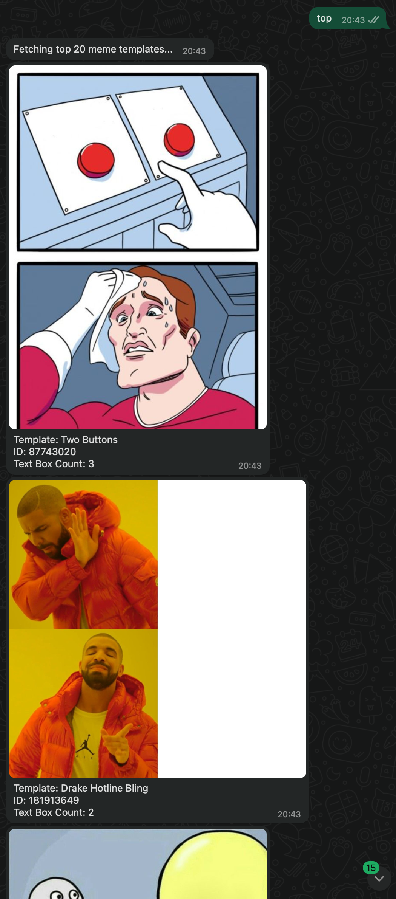

# 🤖 WhatsApp Meme Generator

Turn your WhatsApp into a meme factory! This bot uses Imgflip's powerful API to generate and send memes directly through WhatsApp. Whether you want AI-generated memes, caption your favorites, or create custom GIFs - we've got you covered! 🎨

[](https://meme-machine-web.vercel.app)
[](https://github.com/yourusername/meme_machine)


## ✨ Features
- 🧠 AI-powered meme generation using Imgflip's API
- 📱 Direct WhatsApp integration via Twilio
- 🎯 No watermarks on generated memes
- 📊 Automatic metadata tracking of all your creations
- 🎲 Surprise meme generation from curated prompts
- 🔍 Advanced meme template search
- 📈 Access to top and random meme templates

## 🎮 WhatsApp Commands

Send these commands to your WhatsApp bot:

```
generate [text]    🤖 Generate an AI-powered meme based on your text
meme [text]        🎲 Let Imgflip choose the perfect template for your text
surprise          🎁 Get a random meme from our curated collection
search [query]     🔍 Search for meme templates by keyword
top                ✨ View the 20 most popular meme templates
random             🔄 View 20 random meme templates
caption [id]       📝 Add your text to a specific meme template
help              ❓ Show all available commands
```

## 🎯 Function Examples

### AI Meme Generation
```
generate A funny cat sitting on a chair
generate A dog dancing in the rain
```


### Auto Meme Generation
```
meme I'm tired of all these meetings
meme Finally weekend!
```


### Surprise Meme
```
surprise
```


### Meme Search
```
search cat
search dog
search funny
```


### Template Browsing
```
top
random
```


### Custom Captioning
```
caption 181913649
```
(After entering the ID, the bot will prompt for caption text)


### Help Menu
```
help
```


## 🎨 What Imgflip Offers

Our integration leverages these awesome Imgflip features:

### 1. AI Meme Generation 🤖
- Uses OpenAI's model to understand your text
- Automatically selects the perfect template
- Generates clever captions that match your intent

### 2. Auto Meme Creation 🎲
- Analyzes your text to find the best matching template
- Automatically positions text for optimal impact
- Works great for quick, spontaneous memes

### 3. Custom Captioning 📝
- Access to 100+ popular meme templates
- Full control over text placement
- Support for custom fonts and styling

### 4. GIF Memes ✨
- Animate your memes with multiple text frames
- Perfect for reaction GIFs
- Supports popular animated templates

## 📊 Metadata Storage

All generated memes are tracked in `website/memes/meme_metadata.json`:

```json
{
  "memes": [
    {
      "timestamp": "2024-03-21T15:30:45",  // Creation timestamp
      "type": "ai",                        // Meme type (ai, auto, caption, gif)
      "query": "funny cat",                // Original query/text
      "imgflip_url": "https://i.imgflip.com/xxx.jpg",  // Direct image URL
      "page_url": "https://imgflip.com/i/xxx",         // Web page URL
      "template_id": 123456,               // Template ID (if used)
      "texts": ["Text 1", "Text 2"]        // Generated/used texts
    }
  ]
}
```

## 🚀 Setup

1. Install dependencies:
```bash
pip install -r requirements.txt
```

2. Configure environment variables in `.env`:
```
TWILIO_ACCOUNT_SID=your_account_sid
TWILIO_API_KEY_SID=your_api_key_sid
TWILIO_API_KEY_SECRET=your_api_key_secret
TWILIO_CHAT_SERVICE_SID=your_chat_service_sid
TWILIO_PHONE_NUMBER=your_phone_number
IMGFLIP_USERNAME=your_imgflip_username
IMGFLIP_PASSWORD=your_imgflip_password
```

3. Start the application:
```bash
# Flask (Web Interface)
cd website
python app.py

# Twilio and imgflip (WhatsApp Bot)
python main.py
```

4. Set up Twilio webhook:
   - Go to your [Twilio console](https://console.twilio.com)
   - Configure the WhatsApp webhook URL to point to your server's `/webhook` endpoint
   - Ensure your server is accessible via HTTPS (required by Twilio)

## 📝 Usage Tips
- Start with `help` to see all available commands
- For AI memes, be descriptive in your text prompt
- Use `search` to find specific meme templates
- Try `surprise` for a random meme from our curated collection
- Use `top` to see trending templates
- Use `random` to discover new templates
- For custom captions, first use `search` to find a template ID
- All memes are stored on Imgflip's servers and accessible via URLs in the metadata
- Browse your meme history in the metadata JSON file

## ⚠️ Notes
- Imgflip AI meme generation requires a Premium API subscription
- First 50 creations per month are included
- For best results, keep text prompts clear and concise
- Some templates work better with shorter text

## 📸 Examples
[Screenshots coming soon!]

## 🔗 Links
- [Live Demo](https://meme-machine-web.vercel.app)
- [GitHub Repository](https://github.com/yourusername/meme_machine)
- [Imgflip API Documentation](https://imgflip.com/api)
- [Twilio WhatsApp API](https://www.twilio.com/whatsapp)
